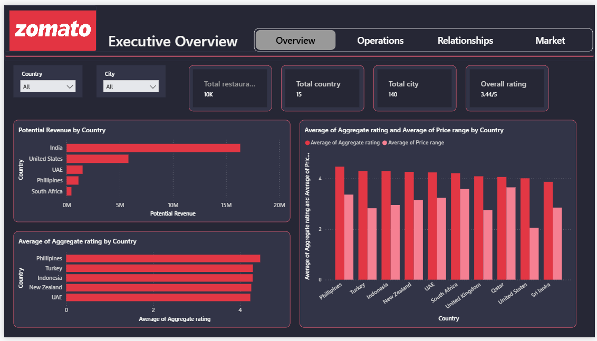

## Zomato Restaurant Performance & Growth Strategy

**Goal:** Conduct an end-to-end performance and operational analysis of Zomato's restaurant network, identify opportunities to improve customer engagement, visibility, and operational adoption, and prioritize the unrated restaurant segment representing 22.5% of the dataset.  

**Description:** The project focused on simulating a real-world business analytics engagement by analyzing a dataset of 9,551 restaurants across 141 cities and 15 countries to investigate how characteristics like online delivery, table booking, price range, and location relate to performance. The project involved structured data analysis across five major business areas, using SQL for data cleaning, validation, restaurant segmentation, and city-level operational comparisons. The analytical findings were then translated into a strategic growth plan with actionable business recommendations designed to reduce the unrated backlog, optimize delivery onboarding, expand table-booking adoption, and implement targeted quality-improvement programs.  

**Skills:** data cleaning, data validation, exploratory data analysis (EDA), database querying, conditional aggregation, subqueries, restaurant segmentation, customer engagement analysis, business KPI analysis, geographic analysis, data storytelling, strategic prioritization, business recommendation development.  

**Technology:** SQL, MySQL, Power BI, PowerPoint, Excel/CSV.  

**Results:** The analysis identified critical coverage and performance gaps across Zomato's network, revealing that 2,148 restaurants (22.5%) are completely unrated and only 12.1% offer table-booking capabilities despite booking-enabled venues showing significantly higher customer engagement. Operational and price-tier segmentations uncovered distinct variation in customer votes and average costs for two, while regional analysis successfully isolated high-risk markets like New Delhi, Noida, and Faridabad. These insights established a prioritized strategic roadmap that delivers data-driven solutions to improve customer trust, drive online-delivery optimization, and maximize platform commercial value.
